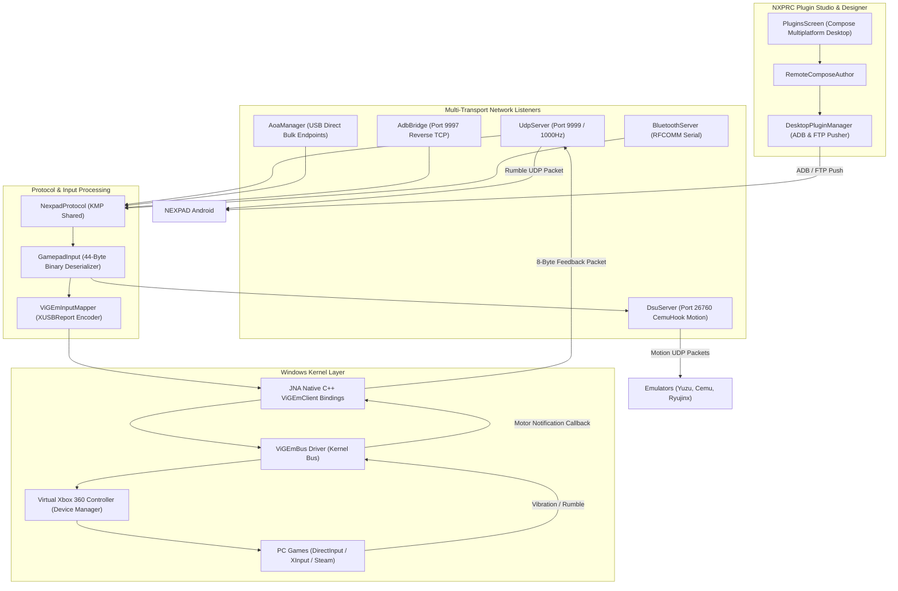

# 🏛️ NEXPAD Desktop Architecture

Deep technical design, kernel driver bindings, and networking pipelines of the **NEXPAD Desktop** server application.

```
                    ┌───────────────┐
                    │   README.md   │
                    │ "What is it?" │
                    └───────┬───────┘
                            │
          ┌─────────────────┼──────────────────┐
          ▼                 ▼                  ▼
     HISTORY.md         ROADMAP.md       ARCHITECTURE.md
     "Where we         "Where we're       "How it
      came from"          going"           works"
```

---

## 🏗️ High-Level System Architecture



---

## 🎮 Windows Kernel Driver Pipeline (`ViGEmBus`)

The core driver engine relies on **Java Native Access (JNA)** interfacing directly with the Windows C++ driver `ViGEmClient.dll`.

### 1. Virtual Controller Lifecycle
1. **Bus Allocation**: `vigem_alloc()` allocates the driver client handle.
2. **Bus Connection**: `vigem_connect()` attaches to the `\Device\ViGEmBus` kernel device driver.
3. **Target Instantiation**: `vigem_target_x360_alloc()` creates a virtual Xbox 360 peripheral node.
4. **Target Registration**: `vigem_target_add()` plugs the virtual controller into Windows Plug-and-Play (PnP). Windows Device Manager immediately enumerates `Xbox 360 Controller for Windows`.

### 2. Fast Input Injection (`XUSBReport`)
Every incoming 44-byte binary packet from Android is converted into a native C `XUSB_REPORT` structure:
```cpp
typedef struct _XUSB_REPORT {
    USHORT wButtons;      // Bitmask of ABXY, DPad, Bumpers, Start, Back, Thumbs
    BYTE   bLeftTrigger;  // 0 - 255
    BYTE   bRightTrigger; // 0 - 255
    SHORT  sThumbLX;      // -32768 to 32767
    SHORT  sThumbLY;      // -32768 to 32767
    SHORT  sThumbRX;      // -32768 to 32767
    SHORT  sThumbRY;      // -32768 to 32767
} XUSB_REPORT;
```
The driver pushes this report via `vigem_target_x360_update()` in $< 0.1\,\text{ms}$.

### 3. Bidirectional Rumble Callbacks
When a PC game triggers haptic force feedback:
1. ViGEmBus fires a C native callback registered via `vigem_target_x360_register_notification()`.
2. The callback extracts `LargeMotor` (0–255) and `SmallMotor` (0–255) vibration levels.
3. The server serializes this into an 8-byte `PACKET_TYPE_FEEDBACK` packet and transmits it over UDP/AOA back to Android.

---

## 🌐 Server Networking & Transports

### 1. High-Speed UDP Server (`UdpServer.kt`)
- Operates a non-blocking `DatagramChannel` listening on port `9999`.
- **Honest Telemetry**: Calculates round-trip time (RTT), transmission jitter, and packet delivery rates with microsecond timestamps.
- **Heartbeat & Watchdog**: Detects phone disconnects after $3000\,\text{ms}$ of silence, automatically zeroing controller inputs to prevent games from executing stuck actions.

### 2. AOA USB Direct (`AoaManager.kt`)
- Interacts with Android Open Accessory endpoints via `usb4java`.
- Sends AOA control requests (`GET_PROTOCOL 51`, `SEND_STRING 52`, `START 53`) to trigger phone transition into accessory mode.
- Streams input over USB bulk IN endpoint and rumble over USB bulk OUT endpoint.

### 3. CemuHook Motion Server (`DsuServer.kt`)
- Implements the Cemuhook DSU motion protocol on UDP port `26760`.
- Broadcasts 6-axis gyroscope and accelerometer data to Nintendo Switch/Wii U emulators.

---

## 🎨 NXPRC Plugin Studio & Designer

Desktop contains an integrated visual authoring environment for custom HUD controller packages:
- **`RemoteComposeAuthor`**: Generates binary `.nxprc` documents containing DOM nodes, CSS rules, and timeline tracks.
- **`DesktopPluginManager`**: Automatically detects connected Android phones via `adb devices` or local FTP and deploys packages with one click.
